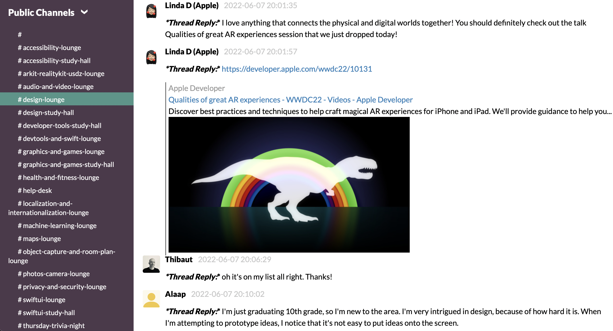

## WWDC22 Digital Lounges Dump

This is a dump of the Slack channels from the Digital Lounges of WWDC22, to be used for reference purposes.

## How to visualize the Digital Lounges

* Download the repo and open the `index.html` file in your browser of choice for local access. All pages are static. Use the menus to the left to navigate the different channels.

  

* Alternatively, visit the site hosted in GitHub pages [here](http://adriantineo.com/WWDC22-Digital-Lounges-Dump/).

## Known issues

* Some channels may be missing
* Threads are shown inline
* Some external links for images or videos are not included

## How has the dump been obtained?

The following tools have been used:

* [Slack Dumper](https://github.com/rusq/slackdump), to obtain the dump of Slack messages
* [Slack Export Viewer](https://github.com/hfaran/slack-export-viewer), to visualize the dumps via a local server
* [SiteSucker](https://apps.apple.com/us/app/sitesucker/id442168834?mt=12), to generate static pages
